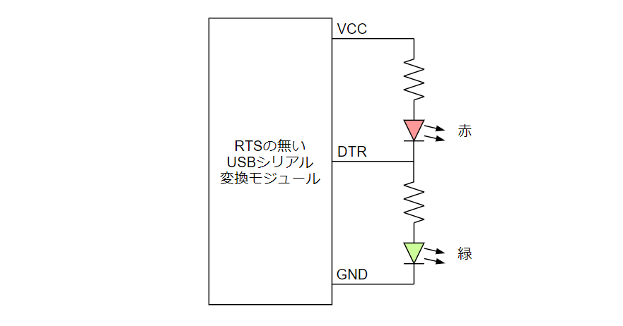

# IMEの状態をCOMポートに出力する奴

## 概要

IMEの状態を読み取り、シリアルポートのDTS/RTS端子に反映する常駐アプリです。DTS/RTS端子にLEDを接続してIMEの状態を表示するのを想定しています。

https://user-images.githubusercontent.com/40152459/174389353-7c8a4bc3-478f-41e9-8b25-c7db305f3b55.mp4

## アプリのダウンロード

[Releases](https://github.com/shapoco/ImeTo232C/releases) から最新の Asset をダウンロードしてください。

## インストールと初期設定

インストーラーはありません。

1. 適当なディレクトリを作成し ImeStatusToComPort.exe を配置してください。
2. ImeStatusToComPort.exe を起動します。
3. タスクトレイのアイコンをダブルクリックして設定ウィンドウを表示します。
4. 常駐させる場合は「Windowsの起動時、自動的に本ソフトを起動する」にチェックします。
5. 使用するCOMポートをドロップダウンリストから選びます。

## 設定変更

タスクトレイのアイコンをダブルクリックして設定ウィンドウを表示します。

## アンインストール

ImeStatusToComPort.exe を削除するだけでもよいですが、設定ファイルが残るのが嫌な場合は以下のようにしてください。

1. ImeStatusToComPort.exe を起動し、設定ウィンドウを表示します。
2. 下部の「設定ファイルの場所」をクリックしてフォルダを開きます。
3. 設定ウィンドウを閉じて、本ソフトを終了します。
4. Settings.cfgが入ったフォルダごと削除します。

## 配線例

### 推奨例

小さなLEDを1個ずつ駆動するだけなら、シリアルモジュール、LED、抵抗を用意して下図のように接続すれば制御できます。ただし、シリアルモジュールはDTRとRTS信号が引き出せるものを用意する必要があります。秋月電子さんのFT232RL搭載のモジュール [AE-UM232R](http://akizukidenshi.com/catalog/g/gK-01977/) などが使用できます。

### 明るさが必要な場合

高輝度なLEDを5個並列にしてパワーMOS-FETで駆動することもできます。

### RTS信号が使えない場合

シリアルモジュールには、DTR信号しか引き出せないものが多いです。一応、下図のような接続でも似たような動きはできると思いますが、この場合は常にどちらか一方のLEDが点灯した状態になります。サスペンド状態などでUSBの電源供給が止まらない場合でも点きっぱなしになってしまうので、そういう場面でちょっと格好悪くなります。

## 更新履歴

|date|ver|更新内容|
|:--|:--|:--|
|2018/9/23|0.1.1.0|点滅機能追加、COMポートリストの挙動がおかしいの修正|
|2018/2/17|0.1.0.0|公開|

